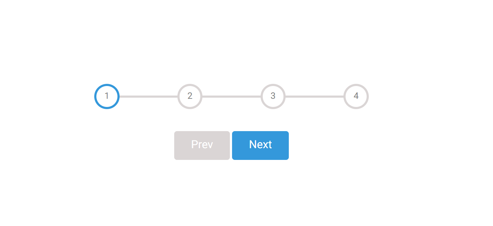

# Step Progress Bar

A simple and interactive **Step Progress Bar** built with **HTML**, **CSS**, and **Vanilla JavaScript**. The project visually represents progress through multiple steps and updates the progress line dynamically as users navigate using the **Next** and **Prev** buttons.

## ✨ Features

* Interactive multi-step progress bar
* Dynamic progress line animation
* Active step highlighting
* Next and Previous navigation buttons
* Automatically disables:

  * **Prev** button on the first step
  * **Next** button on the last step
* Smooth CSS transitions

## Technologies Used

* HTML5
* CSS3
* Vanilla JavaScript (ES6)

## 📂 Project Structure

```
Step progress bar/
│── index.html
│── style.css
└── script.js
```

## How It Works

* The progress starts at **Step 1**.
* Clicking **Next** moves to the next step.
* Clicking **Prev** returns to the previous step.
* The active circles are highlighted automatically.
* The blue progress line grows or shrinks based on the current step.
* Navigation is limited to the available steps, preventing users from moving beyond the first or last step.

## Getting Started

1. Clone the repository:

```bash
git clone https://github.com/NargesHaidari/Step-Progress-Bar-.git
```

2. Open the project folder.

3. Launch `index.html` in your web browser.


## 📸 Preview



```

##  Author
Created by **Narges Haidari**
